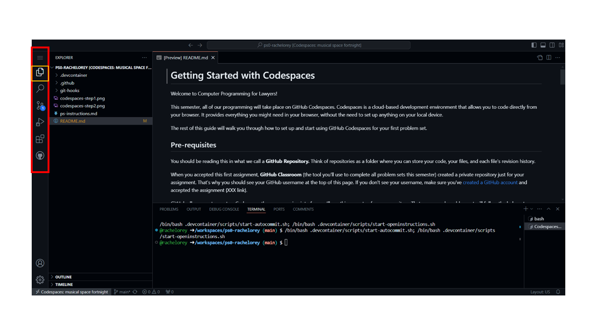
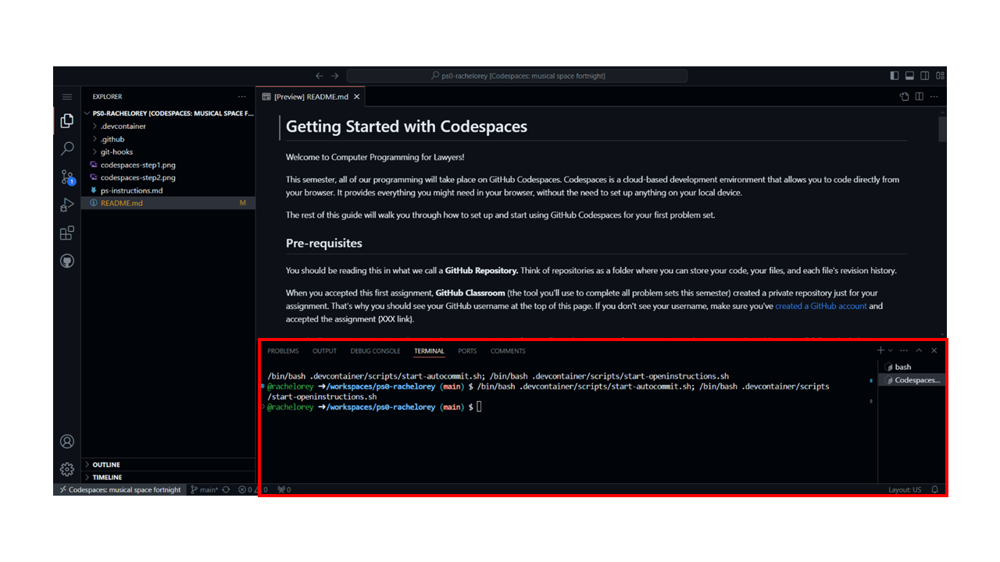

# Congrats! If you're seeing this, you've probably just created a Codespace for the first time. That's awesome.
The rest of this problem set is designed to get you acquainted with the interface. We'll be spending a lot of time here this semester.

## 1. The coding space

Where you're reading right now is what we'll call the coding space. This is the space where you'll be able to view and edit files – where the coding happens!

### 2. The File Explorer

This is your file explorer. It shows all the files pertaining to your Codespace. In most cases, they reflect exactly what's in the GitHub repository you used to create this Codespace.

### 3. The Navigation Pane

This is your navigation pane. You can largely ignore this for now, we’ll get more comfortable with it throughout the course.

You can click the top document icon to get back to the file explorer.

> [!WARNING]
> Don't edit the ".devcontainer" or "git-hooks" folders. We've set those up to make your programming easier. If you edit or delete them, it could impact your ability to complete or submit your assignment. 

### 4. The Terminal

This area serves multiple purposes, but we’ll primarily be using it to access your **Terminal**. Think of the terminal as a place where you tell the development environment (Codespaces) what to do: create new files, execute programs, and more.

### 5. Full Interface

Now, take a look at your full screen. Everything you see is the full interface where you can see the file explorer, navigation pane, coding space, and terminal together. Look around and get comfortable with what you see. 

### Next Steps

Now that you've gotten acquainted, let's try interacting with the terminal (remember, that's the section taking up the bottom middle and right of your screen). To access the instructions that follow type **ps0-instructions.md** into the terminal and hit enter. That should open the instructions for your problem set. 
